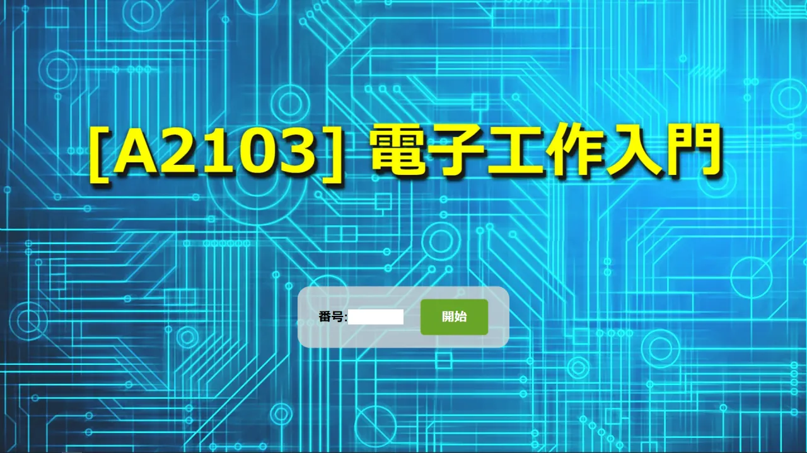
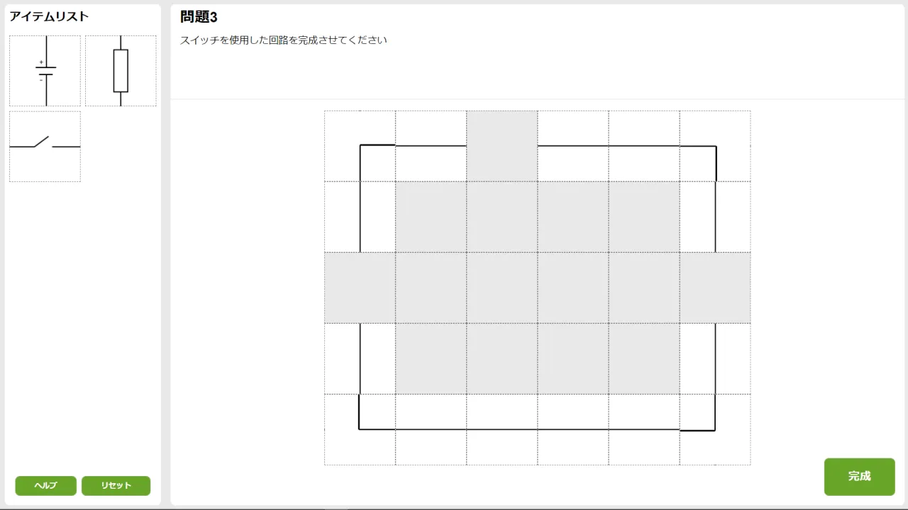
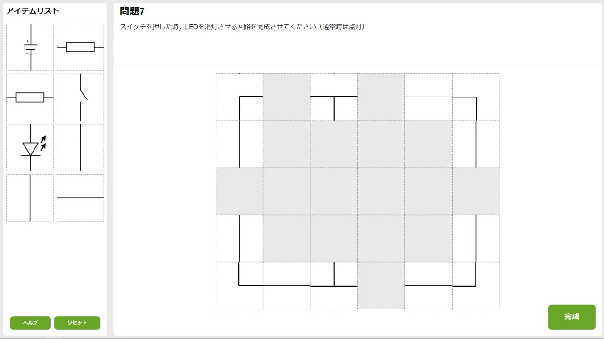

Circuit Simulator
====

## Description
電子工作入門講座で使用した回路の作成を行うWebアプリです．
ユーザはドラッグ＆ドロップで素子を配置し，回路を作成することができます．主な機能として以下のようなものがあります．

- 回路正誤判定
- 問題管理，配布制御
- ユーザ進捗監視
- ユーザヘルプ機能

## Demo
[e-circuit](https://e-circuit.herokuapp.com/)

## Licence
[MIT](LICENSE)
